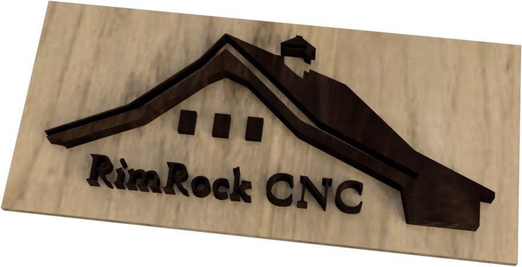

# 🏡 About

We are a small CNC shop located in [📍 Hayden, Idaho](https://goo.gl/maps/7UHUCGFa1Cs4T9Qk9).

Our focus is on limited release and small batch item manufacturing.

# Store

- [Etsy Store](https://www.etsy.com/shop/rimrockcnc)

# Machining Plans

## Furniture

- [Modern Nightstand](pages/modern-nightstand.html)

## 3D Carving

- [Eames Birds](pages/eames-bird.html)

# Software

- [Autodesk Fusion 360](#) - allows for both CAD and CAM workflows in one.
    - [Post Processor](https://github.com/suprak/onefinity-post-processors)
- [CAMotics](#) - for independenty validating the G-Code produced by Fusion.

# CNC Machine(s)

- [OneFinity Journeyman](https://www.onefinitycnc.com/cnc-machines)

# Bits

- [Amana Tools](https://www.amanatool.com/)

# Contact

For comments or feedback [💌 email us](mailto:info@rimrockcnc.com) or join us in the [💬 discussion](https://github.com/suprak/rimrock-cnc/discussions).