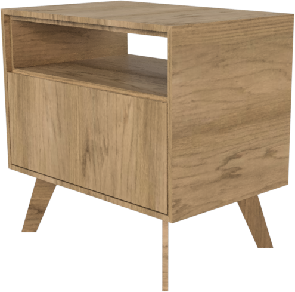
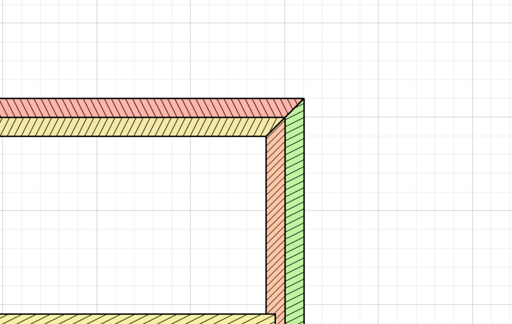
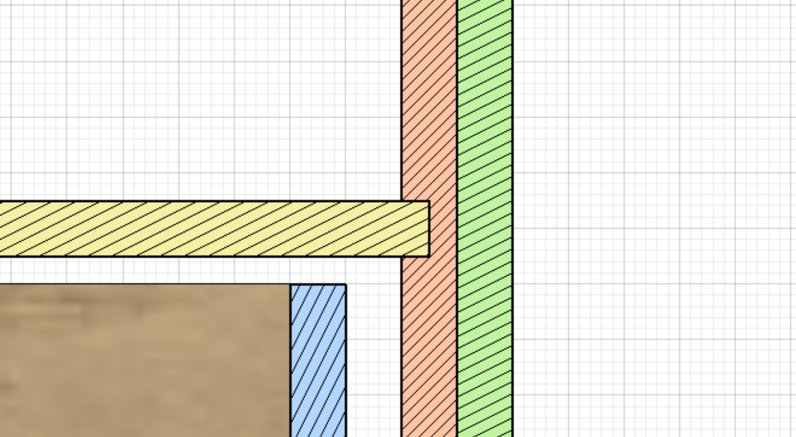
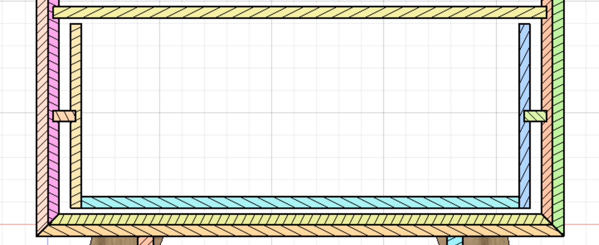
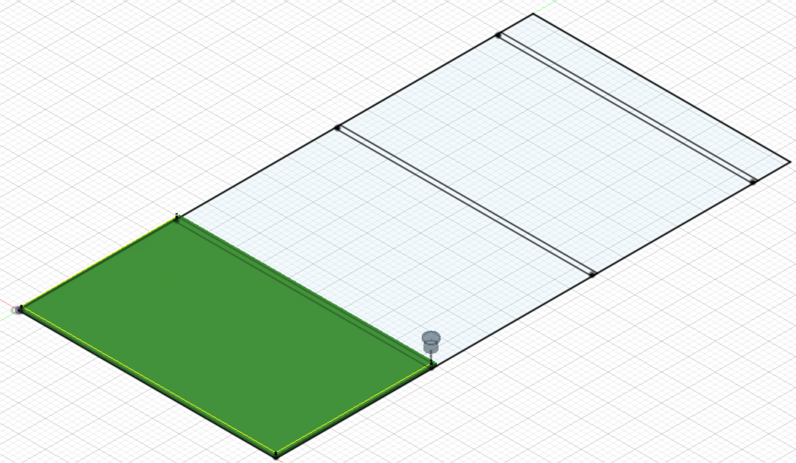
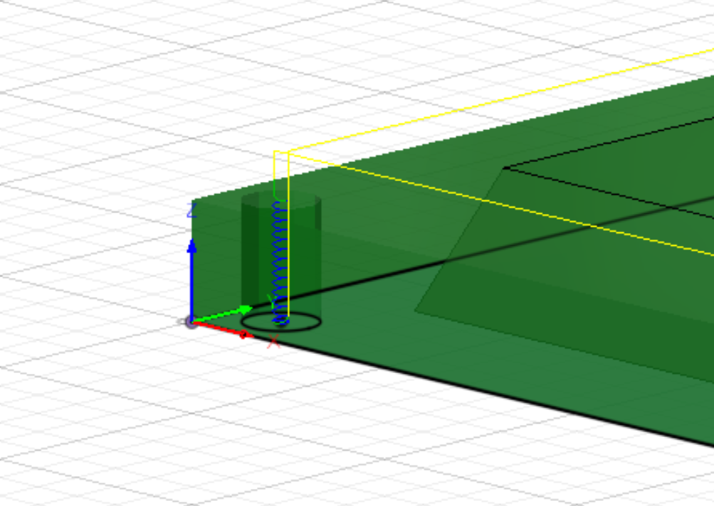
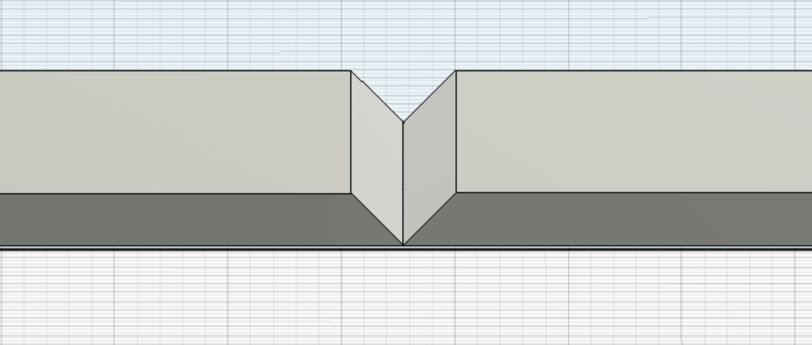
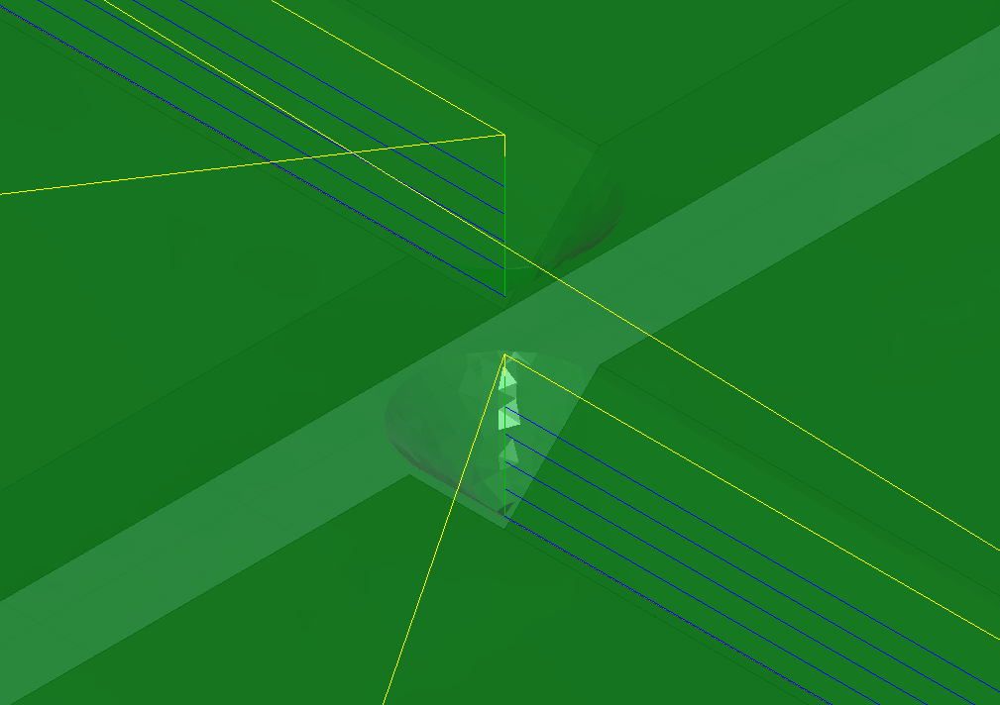

# Credit

The nightstand was designed and published by [Wood Shop Diaries](https://www.woodshopdiaries.com/diy-mid-century-modern-nightstand/).

This document outlines the adaptation process to CNC machining.

# Design Features

## Changes

- Stock used is `0.5"` instead of `0.75"`
- Miter corners
- Plywood drawer slides
- Inset shelf mount

## Miter Corners

## Inset Shelf

## Drawer Slides

# Manufacturing

The various [design](#design%20features) choices outlined above affect the layout requirements of the parts in the stock.

## Prerequisites

- Practice [Sections](#sections)
    - Practice [Locator Holes](#locator%20holes)

## Bits Used

- `91*` V-Groove
- `1/4"` Downcut
- `1/4"` Upcut

## Stock

Single sheet of `4' x 8' x 0.5"` plywood.

**TBD**: Stock hold down to be used. Either double sided tape or brad nails.

## Operations

1. Boring locator holes
2. Corner miters
3. Downcut cutouts
4. Upcut cutouts

## Sections

The stock is split into four sections due to the limitations of the CNC work area.

Sections are `48" x 30"` in size, with a `1"` overlap between sections. The overlap ensures that operations that span multiple sections are smooth and complete.

The manufacturing operations are split up by bit. With all the same type of operations (ex miters) being performed across all sections in sequence.

## Locator Holes

Locator holes are needed on every [section](#sections).

The holes are located in each of the four corners of each section at the defined offset.

The assumption is that the spill board already has these holes, so only the stock needs machining.

`1/4"` wood dowels are then used to locate each section accurately on the work area. In particular this is needed to maintain accuracy as the full stock is moved through the work area.

**Diameter:** `5/16"`  
**Offset:** `0.25"` (from each corner)

Fusion 360's "Bore" operation is used to machine these.

## Miter Corners

This project could be accomplished without miter corners, but miter corners are an additional CNC challenge that yields both an assembly and esthetic benefits.

Tracing using the 91 degreee v-groove bit, with multiple passes allows for these miters. The bit was selected to be big enough to cut miters in `0.75"` plywood without the need to complex movements.

# 📦 Download Plans

- [Fusion Project](#)

# Contact

For comments or feedback [💌 email us](mailto:info@rimrockcnc.com) or join us in the [💬 discussion](https://github.com/suprak/rimrock-cnc/discussions).